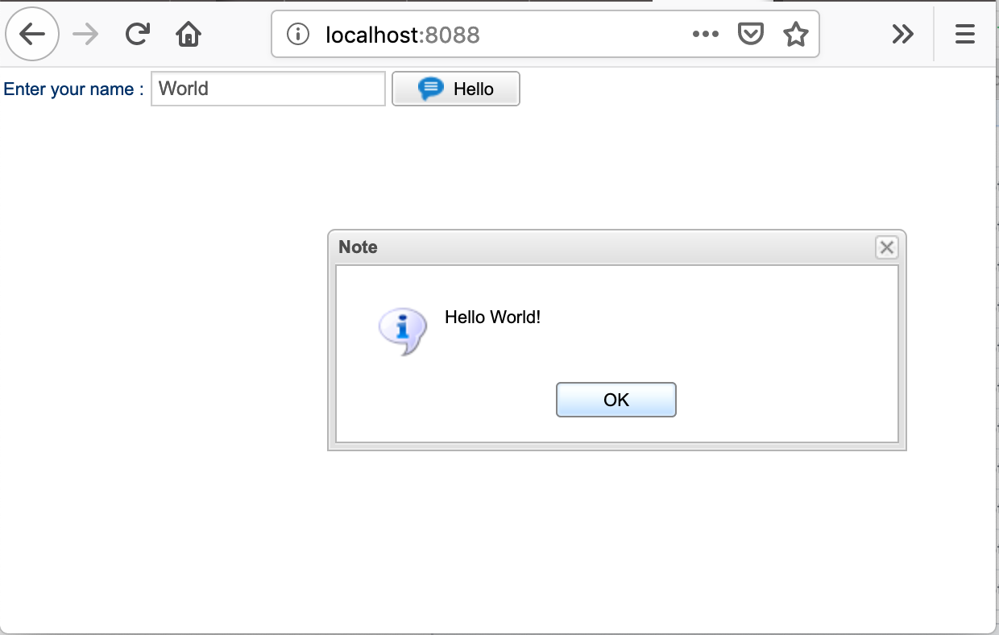

# Hello World: Smartclient + Kotlin

*IMPORTANT* This exampled *does not* include the SmartClient Runtime.

Before running the example, copy your SmartClient Runtime (*) into the isomorphic folder.

Here is how the structure should look like

*hello-world-smartclient-kotlin/*

```
ls isomorphic/
locales	login	skins	system
```

(*) Trial is available at https://www.smartclient.com/product/download.jsp

## Building and Running

```
# First create the bundle
./gradlew bundle

# Run the webpack dev server
./gradlew run
```

Navigate to http://localhost:8088

When making changes, recreate the bundle

```
./gradlew bundle
```

## IDE

Any text based editor will do. The free **Intellij Community Edition** provides good support for gradle and kotlin.

## Final result


